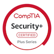
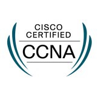

# 👋 Hi, I'm Devin  
**Cybersecurity Engineer | Network Engineer | Secure Systems Architecture**

I'm a CompTIA CySA+, Security+, and CCNA-certified engineer with deep experience across threat detection, secure system design, and enterprise network operations. My background spans **Cisco routing/switching**, **z/OS mainframe administration**, **Linux/Windows hardening**, and **PKI/TLS lifecycle management**. I build scenario-driven labs that replicate real attacker behaviors and design defensive controls that stand up to them.

---

## 🧠 Core Skills
- 🔍 Threat detection, MITRE ATT&CK mapping, phishing triage  
- 🧪 Log analysis, SIEM tuning, anomaly detection, forensic validation  
- 🖥️ z/OS mainframe systems administration, RACF/IAM, RMF control mapping  
- 🛠️ Python, Bash, Splunk, Wireshark, syslog/rsyslog pipelines  
- 🔐 PKI/TLS lifecycle, certificate automation, secure configuration baselines  
- 🌐 Cisco routing/switching, VLANs, STP, OSPF, EIGRP, ACLs, NAT  
- 📡 WAN/LAN design, SNMP monitoring, packet-level diagnostics, network segmentation  

---

## 🧰 Tools & Technologies
- 
- 
- 
- 
- 
- 
- 
- 

---

## 🏆 Certifications

---

## 🖼️ Credly Badges

  
  
  
  

---

## 🔬 Security Architect & Network Labs (Active Projects)
- **Suricata Detection Pipeline** — containerized IDS with custom rule injection and Caldera adversary emulation  
- **Email Header Triage PBQ** — CySA+‑style phishing analysis with automated header parsing  
- **MITRE Mapping Engine** — automated log-to-technique correlation for SIEM enrichment  
- **Certificate Lifecycle Lab** — end‑to‑end PKI/TLS automation with OCSP, CRL, and secure renewal workflows  
- **Linux Auditd + Splunk Pipeline** — hardened endpoint telemetry with TA‑linux_auditd parsing  
- **Cisco Enterprise Lab** — OSPF/EIGRP redistribution, VLAN design, ACL hardening, SNMP monitoring, and packet capture workflows  

---

## 🎯 Career Focus
I’m building toward roles in **Security Engineering**, **Network Engineering**, and **Systems Security Architecture**, with an emphasis on hands-on implementation, adversary emulation, and secure system design.

---

## 🤝 Connect
[LinkedIn](https://www.linkedin.com/in/devinjclements/) • [GitHub](https://github.com/DevinClements) • [Email](mailto:devinjclements@gmail.com)

