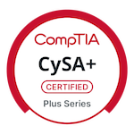
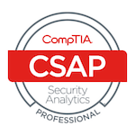

# 👋 Hi, I'm Devin

I'm a Security+ certified cybersecurity analyst with deep expertise in threat hunting, log analysis, and incident response. Currently pursuing **CySA+** to sharpen my detection engineering and real-world SOC capabilities.

## 🧠 Skills & Focus Areas
- 🔍 Threat detection, MITRE ATT&CK mapping, phishing triage
- 🧪 Log analysis, SIEM tuning, scenario-based detection
- 🖥️ z/OS mainframe systems administration
- 🛠️ Python, Bash, Splunk, Wireshark

## 🧰 Tools & Technologies
-	
-	
-	
-	
- 
-	

## Badges 

<!-- START CREDLY BADGES -->

  
  
   

  

<!-- END CREDLY BADGES -->

## 🏆 Certifications

## 📌 Future Projects
- [Advanced Threat Simulation]— realistic attacker emulation with layered detection logic
- [Email Header Triage PBQ] — CySA+ style phishing analysis with header parsing
- [MITRE Mapping Engine]- automated log-to-technique correlation

## 🎯 Goals
- Pass **CySA+** with high proficiency (exam scheduled: Saturday @ 10:30 AM)
- Transition into high-impact technical roles that value mastery over management
- Build a portfolio of hands-on certs: GIAC, SSCP, GCIA, SecurityX

## 🤝 Connect
[LinkedIn](https://www.linkedin.com/in/devinjclements/) • [GitHub](https://github.com/DevinClements) • [Email](mailto:devinjclements@gmail.com)

